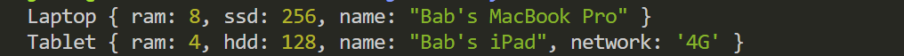
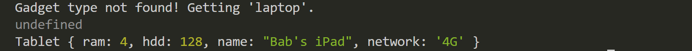

# web603-class-w5d1

## Getting Started

Construct a constructor for `Laptop` and `Tablet` respectively.

Then export the `Laptop` and `Tablet` modules in a common JS context.

## Understanding Factory Design Pattern

`gadgetFactory.js` implements a simple factory design pattern for creating gadget objects, specifically laptops and tables, based on a given type and set a of attributes.

The constructors of `Laptop` and `Tablet` are designed to initialize new instances of laptops and tablets with specific properties.

### The Registry
The gadget type registry, `const gadget = { Laptop, Tablet };`, acts as a registry mapping string identifiers ("Laptop" and "Tablet") to the corresponding constructor function (`Laptop` and `Tablet`).

### The Factory Function
The factory function, `createGadget`:
- takes a `type` argument, a string expected, to match one of the keys in the `gadget` registry (i.e., either "Laptop" or "Tablet").
- takes an `attributes` argument, which is an object containing the properties to be set on the new gadget instance.
- determines the correct constructor function, as `type` will be looked up in the `gadget` registry.
- instantiates a new object of the request type by passing `attributes` to the selected constructor function.
    - The `new` keyword is used to ensure a new instance is created.
- returns the newly created gadget instance.

## Test
In `index.js`, check out how the arguments, `type` and `attributes`, are passed to the factory function `createGadget`:

```js
const myLaptop = gadgetFactory.createGadget("Laptop", {
  ram: 8,
  ssd: 256,
  name: "Bab's MacBook Pro"
});

const myTablet = gadgetFactory.createGadget("Tablet", {
  ram: 4,
  hdd: 128,
  network: "4G",
  name: "Bab's iPad"
});
```

Print the two objects in the console:



If `type` is not found in the `gadget` registry, for example,

```js
const myLaptop = gadgetFactory.createGadget("laptop", {
  ram: 8,
  ssd: 256,
  name: "Bab's MacBook Pro"
});
```

Print the two objects in the console:


